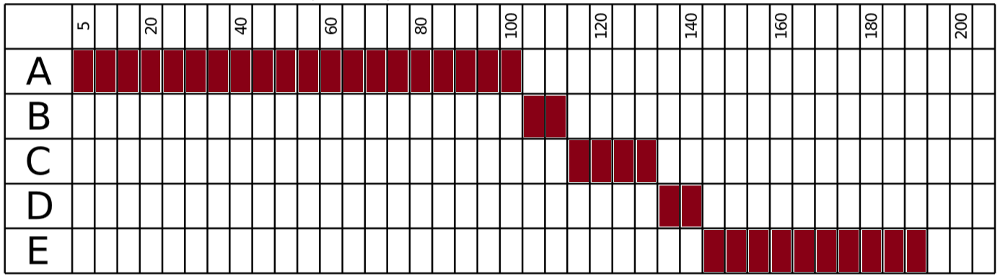
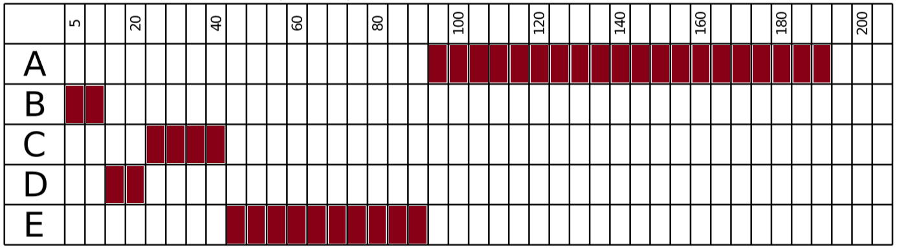
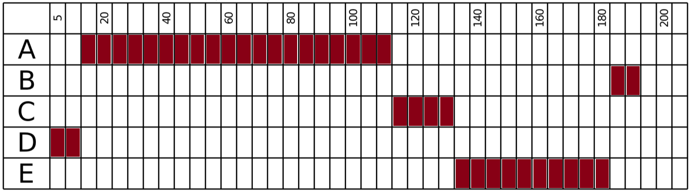
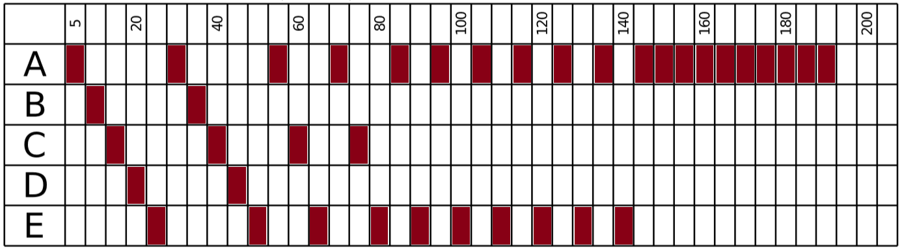
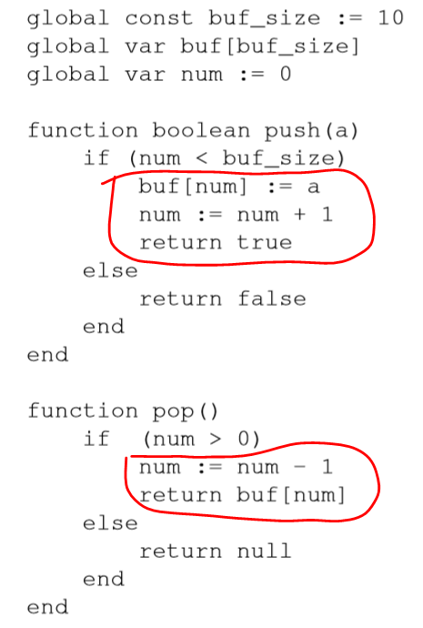

# Aufgabe 1)
## a) Wie verhält sich eine Applikation die aus mehreren Prozessen bzw. aus mehreren UserspaceThreads besteht bei einem blockierenden Diskzugriff?

## b) Welche der folgenden Ressourcen werden von allen Threads eines Prozesses geteilt und welche bestehen pro Thread? Program-Counter, Heap-Speicher, globale Variablen, Stack, CPU-Register, geöffnete Dateien, Accounting- und Benutzer-Informationen.

# Aufgabe 2)
## a) Langezeit- / Kurzzeitscheduling

Das Langzeit-Scheduling übernimmt die Zuteilung von Zeit und Speicher zu einer Task. Wird eine Task gerade bearbeitet übernimmt das Kurzzeit-Scheduling und teilt der CPU die im Speicher befindlichen Prozesse zu.

## b) Warum I/O- / CPU-bound unterscheiden

CPU-bound Prozesse können selbstständig auf der CPU ablaufen, während I/O- bound Prozesse von dem Daten Eingang aus einer anderen Quelle angewiesen sind. Die Prozesse müssen darauf warten, und können erst nach dem Empfang der Daten weiterverarbeitet werden. D.h., damit die Prozesse effizient geschedulet werden können, muss man die Wartezeiten bei I/O-bound Prozessen beachten und diese demnach anders behandeln, als CPU-bound Prozesse.

## c) Pros & Cons von premptives/ non-preemptives Multitasking

"Preemptiv" heißt, dass ein Task während der Durchführung zu gunsten eines anderen Tasks unterbrochen werden darf.

### Preemptiv
Pro: Jeder neue Task zu einer Neuzuteilung der CPU führen -> Optimale Laufzeit 
Contra: Prozess kann jeder Zeit die CPU verlieren

### Non-Preemptiv
Pro: Unterbrechungen von Task kann durch System Calls geregelt werden
Contra: keine automatische Optimerung


## d) 
### FCFS
Die Prozesse werden nacheinander, so wie sie reinkommen ausgeführt. Da alle bei t = 0 reinkommen, fangen wir einfach bei A an. 


WT = (100 + 110 + 130 + 140)/5 = 96
TT = (100 + 110 + 130 + 140 + 190)/5 = 134

### Short Jobs First
Der Kürzeste Job fängt an. 



WT = (10 + 20 + 40 + 90)/5 = 32
TT = (10 + 20 + 40 + 90 + 190)/5 = 70

### Priority Scheduling
Die höchste Priorität fängt an.



WT = (10 + 110 + 130 + 180)/ 5 = 86
TT = (10 + 110 + 130 + 180 + 190)/ 5 = 124

### Round Robin mit einer Zeitscheibe von 5
Pseudo - Parallelität: nach 5 Zeiteinheiten wird der nächste Prozess fortgesetzt.



WT(A) = 20 + 20 + 10 + 10 + 5 + 5 + 5 + 5 + 5 + 5 = 90
WT(B) = 5 + 20 = 25
WT(C) = 10 + 20 + 15 + 10 = 55
WT(D) = 15 + 20 = 35
WT(E) = 20 + 20 + 10 + 10 + 5 + 5 + 5 + 5 + 5 + 5 = 80

WT = 50

TT(A) = 190
TT(B) = 35
TT(C) = 75
TT(D) = 45
TT(E) = 140

TT = 97


# Aufgabe 3)

## a) Race Conditions, Deadlock, Starvation und Lösungen



Die Raceconditions entstehen an den Stellen, da mehrer Threads gleichzeitig auf die globalen Variablen zu greifen und diese auch global ändern. Wenn Thread 1 in die Section geht und num um 1 erhöht, ist Thread 2 evtl. auch schon in der If-Bedingung drin, wenn es aber bei `buf[num]` ist hat Thread 1 num schon hochgezählt. Dadurch kann es schnell zu Fehlern kommen. Das gleich kann auch bei `function pop()` passieren.

Raceconditions kann man leicht mit Semaphores lösen. Bspw. kann man atomic Variablen verwenden, auf die nur ein Thread gleichzeitig zugreifen kann. Man könnte auch mit verschiedenen Bool Variablen arbeiten, um den Zugang für andere Threads zu blockieren, bis der Aktuelle fertig ist. 

## b) Pseudocode zu TestAndSet, Swap, FetchAndAdd

```pseudocode
atomar function TestAndSet(address)
    oldvalue=address;
    address=1;
    return oldvalue;
```

```pseudocode
atomar function Swap(a1, a2)
    temp=a1;
    a1=a2;
    a2=temp;
```

```pseudocode
atomar function FetchAndAdd(address)
    oldvalue=address;
    address=address+1;
    return oldvalue;
```

## c) binäre Semaphore
typedef struct semaphor{
    bool v;
    Queue *q;
}
void init(Semaphor *s, bool v){
    s->v=v;
    s->queue.empty();
}
void P(Semaphor *s){

}
void V(Semaphor *s){

}


## d) Dining-Philosophers-Problem: Ist die Lösung Deadlockfrei?
circular wait wird ausgeschlossen.
Es ist nicht starvation free, da ein Philosoph nachdem er fertig ist mit Essen und die Gabeln wieder hinlegt, er sie sofort wieder aufnehmen kann bevor der andere der auf ihn wartet sie sich nehmen kann.

# Aufgabe 4)
1. -2|2?

2.
101 Semaphore S1=0
102 Semaphore S2=-1
103 Semaphore S3=-2
104 start(P1,P2,P3)
200 down(S1)
211 down(S1)
212 up(S2)
216 down(S1)
217 up(S2)
300 down(S2)
306 down(S2)
307 up(S1)
308 up(S3)
311 down(S2)
312 up(S1)
400 down(S3)

Ich glaube dass der Part nicht ganz funktioniert weil S1 nicht sauber stirbt nach Zeile 308 aber ich weiss auch nicht wie man es lösen soll

3.a.)2
up 3 wird unnötig und dafür lässt man p2 weiterlaufen