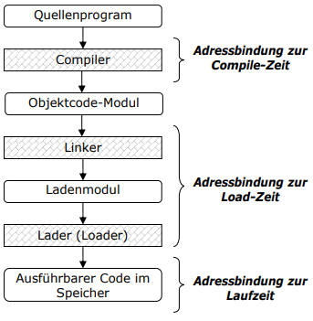

# Theoretische Aufgabe 3

## Aufgabe 1: Konzepte

### a)

- Adressbindung zur Compile-Zeit: Absolute Adressierung gebraucht, keine Relokation möglich.
- Adressbindung zur Load-Zeit: Relokation nur beim Neuladen möglich. (z.B. andere Codemodule oder Systembibliotheken)
- Adressbindung zur Laufzeit: Relokation auch während der Ausführung möglich. (dynamisch verlinkte Bibliotheken)

### b)

Nur bei der Laufzeitadressierung ist es notwendig Prozessadressen und tatsächliche speicheradressen zu trennen.

### c)

- **Swapping**: Die Daten der Prozesse werden abwechselnd in den Speicher geladen und ausgeführt.
- Demand-**Paging**: es wird von beiden Prozessen immer nur ein Teil der Daten in den Speicher geladen und ausgeführt. Bei bedarf (on Demand) werden neue Daten geladen und ersetzen (teilweise) die alten Daten.

### d)

Bei der externen Fragmentierung kann es zu den Phänomen kommen, dass obwohl genug freier Speicher für die neuen Daten vorhanden ist, kein zusammenhängender Block zur verfügung steht, und desshalb der Bereich nicht allokiert werden kann.

- **Paging**: Ich lade nur momentanbenötigte Teile in den Speicher.
- **Garbage-Collection / Compaction**: Ich räume den Speicherbereich regelmäßig auf (und schiebe Speicher zusammen.)

### e)

// TODO

### f)

Es gibt mindestens soviele Fehler wie Anzahl Seiten, da dass Befüllen Fehler verursacht.
Es gibt maximal so viele Seitenfehler wie Speicherzugriffe.
## Aufgabe 2: Virtueller Speicher - Demand Paging

### a)

### b)

232   Adressen * 4 Bytes pro Adresse = 16 GiB

### c)

// TODO

### Aufgabe 3
a.)

|     | 3 | 2 | 1 | 0 | 3 | 2 | 4 | 3 | 2 | 1 | 0 | 4 | 2 | 3 | 2 | 1 | 0 | 4 |
| --- |:-:|:-:|:-:|:-:|:-:|:-:|:-:|:-:|:-:|:-:|:-:|:-:|:-:|:-:|:-:|:-:|:-:|:-:|
|  1. | 3 | 3 | 3 | 2 | 1 | 0 | 3 | 3 | 3 | 2 | 4 | 4 | 2 | 0 | 0 | 2 | 3 | 1 |
|  2. |   | 2 | 2 | 1 | 0 | 3 | 2 | 2 | 2 | 4 | 1 | 1 | 1 | 2 | 2 | 3 | 1 | 0 |
|  3. |   |   | 1 | 0 | 3 | 2 | 4 | 4 | 4 | 1 | 0 | 0 | 0 | 3 | 3 | 1 | 0 | 4 |
|     | F | F | F | F | F | F | F |   |   | F | F |   | F | F |   | F | F | F |

|     | 3 | 2 | 1 | 0 | 3 | 2 | 4 | 3 | 2 | 1 | 0 | 4 | 2 | 3 | 2 | 1 | 0 | 4 |
| --- |:-:|:-:|:-:|:-:|:-:|:-:|:-:|:-:|:-:|:-:|:-:|:-:|:-:|:-:|:-:|:-:|:-:|:-:|
|  1. | 3 | 3 | 3 | 3 | 3 | 3 | 2 | 1 | 0 | 4 | 3 | 2 | 2 | 1 | 0 | 4 | 3 | 2 |
|  2. |   | 2 | 2 | 2 | 2 | 2 | 1 | 0 | 4 | 3 | 2 | 1 | 1 | 0 | 4 | 3 | 2 | 1 |
|  3. |   |   | 1 | 1 | 1 | 1 | 0 | 4 | 3 | 2 | 1 | 0 | 0 | 4 | 3 | 2 | 1 | 0 |
|  3. |   |   |   | 0 | 0 | 0 | 4 | 3 | 2 | 1 | 0 | 4 | 4 | 3 | 2 | 1 | 0 | 4 |
|     | F | F | F | F |   |   | F | F | F | F | F |   | F | F | F | F | F | F |

Größerer Speicher führt zu mehr Pagefaults == "Belady's Anomaly"

b.)

|     | 3 | 2 | 1 | 0 | 3 | 2 | 4 | 3 | 2 | 1 | 0 | 4 | 2 | 3 | 2 | 1 | 0 | 4 |
| --- |:-:|:-:|:-:|:-:|:-:|:-:|:-:|:-:|:-:|:-:|:-:|:-:|:-:|:-:|:-:|:-:|:-:|:-:|
|  1. | 3 | 2 | 1 | 0 | 3 | 2 | 4 | 3 | 2 | 1 | 0 | 4 | 2 | 3 | 2 | 1 | 0 | 4 |
|  2. |   | 3 | 2 | 1 | 0 | 3 | 2 | 4 | 3 | 2 | 1 | 0 | 4 | 2 | 3 | 2 | 1 | 0 |
|  3. |   |   | 3 | 2 | 1 | 0 | 3 | 2 | 4 | 3 | 2 | 1 | 0 | 4 | 4 | 3 | 2 | 1 |
|     | F | F | F | F | F | F | F |   |   | F | F | F | F | F |   | F | F | F |

|     | 3 | 2 | 1 | 0 | 3 | 2 | 4 | 3 | 2 | 1 | 0 | 4 | 2 | 3 | 2 | 1 | 0 | 4 |
| --- |:-:|:-:|:-:|:-:|:-:|:-:|:-:|:-:|:-:|:-:|:-:|:-:|:-:|:-:|:-:|:-:|:-:|:-:|
|  1. | 3 | 2 | 1 | 0 | 3 | 2 | 4 | 3 | 2 | 1 | 0 | 4 | 2 | 3 | 2 | 1 | 0 | 4 |
|  2. |   | 3 | 2 | 1 | 0 | 3 | 2 | 3 | 3 | 2 | 1 | 0 | 4 | 2 | 3 | 2 | 1 | 0 |
|  3. |   |   | 3 | 2 | 1 | 0 | 3 | 2 | 4 | 3 | 2 | 1 | 0 | 4 | 4 | 3 | 2 | 1 |
|  3. |   |   |   | 3 | 2 | 1 | 0 | 0 | 0 | 4 | 3 | 2 | 1 | 0 | 0 | 4 | 3 | 2 |
|     | F | F | F | F |   |   | F |   |   | F | F | F |   | F |   | F | F | F |

Belady's Anomaly tritt bei LRU nicht auf. Die Vergrößerung des Speichers hat 3 Page Faults eliminiert.

c.) 
Es gelten die Definitionen aus der Aufgabenstellung.
Nennen wir den Schritt des k-ten Seitenzugriff zk.

IA: Für zk=1 gilt:
LRUi und LRUi+1 sind beide leer und es wird zu Page Faults kommen. D.h. die jeweilige Seite wird auf den Speicher geschrieben und die Behauptung gilt.

IS: Für k=n gilt die Behauptung:
Daraus folgt, dass wenn die abgefragte Seite in LRUi ist sie auch in LURi+1 sein muss und die Behauptung gilt.
Falls die Seite noch nicht in LRUi und nicht in LRUi+1 ist, wird dieselbe Seite aus beiden rausgeschmissen(sekundärspeicher) und die neue Seite hereingepackt.

Falls die Seite nicht in LRUi aber in LRUi+1 ist, wird eine Seite aus LRUi entfernt und die Seite eingefügt, LRUi+1 jedoch nicht beachtet. Auch dann gilt die Behauptung.

Auch dann gilt die Behauptung weiterhin

### Aufgabe 4
a.) 
	ii.) --> Sonst kein Verschieben des Speichers möglich (?)

b.)	

|               | A | B | C | D | E |                  |
|:-------------:|:-:|:-:|:-:|:-:|:-:|:----------------:|
|   FirstFit    |   | 1 | 3 |   | 2 | (4 nicht möglich)|
|    BestFit    |   | 2 | 3 | 1 | 4 |                  |
|   WorstFit    |   | 2 |   |   |1/3| (4 nicht möglich)|

c.)	

- First-Fit = 288+88+183 = 559	(Plus Freie Speicherblöcke?)
- Best-Fit  = 83+88+88+174 = 433
- Worst-Fit = 83+276 = 359
	
d.)

- First-Fit, da nur sehr wenig Berechnungen gemacht werden müssen
- ---> Findet passende Lücke = Ende der Suche
	
e.)	
        
1.	F = X-1 Bytes
2.	Fø = (X-1)/2 
3.	Fmin = 0 bei L = n*X (bei perfekt passenden Prozessen?)

